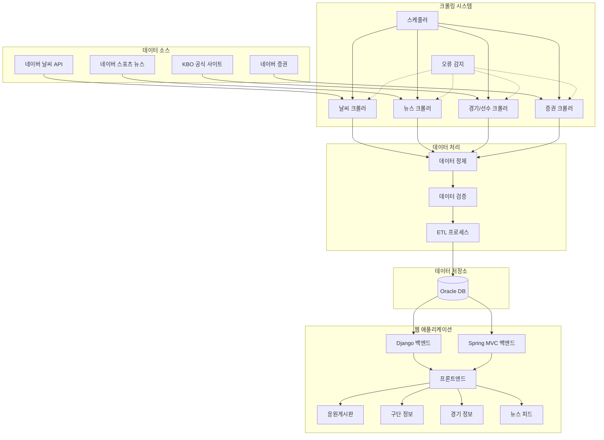

# 🏟️ KBO 리그 통합 데이터 플랫폼

## 📌 프로젝트 목표 및 개요

KBO 리그 팬들은 경기 일정, 선수 기록, 뉴스, 날씨 등 원하는 정보를 얻기 위해 여러 사이트를 방문해야 하는 불편함이 있었습니다. 이러한 정보 탐색의 번거로움을 해소하고, 팬들에게 **KBO 리그에 대한 풍부하고 통합된 정보 경험**을 제공하고자 다양한 데이터를 한 곳에서 쉽고 편리하게 탐색할 수 있는 **KBO 리그 통합 데이터 플랫폼**을 개발했습니다.

---

## ✨ 주요 기능 및 가치

단순 정보 제공을 넘어, 팬들이 KBO 리그를 더욱 깊고 재미있게 즐길 수 있도록 다음과 같은 핵심 가치를 제공합니다.

### 1️⃣ **흩어진 정보, 한 곳에서 편리하게! (데이터 자동 수집 및 통합)**

- **실시간 경기/선수 데이터:** KBO 공식 사이트 정보를 자동으로 가져와 최신 순위, 기록 등을 놓치지 않도록 합니다.
- **야구장 날씨 정보:** 주요 구장 날씨를 미리 확인하여 팬들의 직관 경험을 돕습니다. (네이버 날씨 API 활용)
- **최신 KBO 뉴스:** 네이버 스포츠 뉴스를 자동으로 모아 보여주어 리그 소식을 빠르게 접할 수 있습니다.
- **구단 모기업 정보:** 팬들이 응원하는 팀의 모기업 주가 및 재무 정보를 시각화하여 제공, 팀 운영에 대한 새로운 관점을 제공합니다. (네이버 증권 크롤링)

### 2️⃣ **복잡한 데이터도 한눈에! (직관적인 정보 시각화)**

- **통합 대시보드:** 메인 화면에서 경기 일정과 야구장 날씨를 위젯 형태로 한눈에 파악할 수 있습니다.
- **가독성 높은 정보:** 날씨 정보는 아이콘과 수치로, 구단별 정보(뉴스, 기록 등)는 탭 형태로 구성하여 쉽게 탐색할 수 있습니다.
- **모기업 정보 시각화:** 주가 차트, 주요 재무 지표 등을 시각적으로 제공하여 복잡한 데이터를 쉽게 이해하도록 돕습니다. (Highcharts 활용)

### 3️⃣ **팬들과 함께 즐기는 야구! (커뮤니티 기능)**

- **구단별 응원 게시판:** 10개 구단 팬들이 자유롭게 소통하고 정보를 공유하는 활발한 커뮤니티 공간을 제공합니다.
- **정보 연계 강화:** 게시글 작성 시 경기/선수 태그를 통해 관련 정보 페이지로 바로 연결되어 편리함을 더했습니다.
- **편의 및 관리 기능:** 댓글 알림, 욕설 필터링, 신고 기능으로 편리하고 건전한 커뮤니티 활동을 지원합니다.

### 4️⃣ **믿을 수 있는 정보 제공! (데이터 신뢰도 확보 노력)**

- **크롤링 오류 모니터링:** 비정상 데이터 패턴 감지 시 관리자에게 알림을 보내 데이터 정확성을 유지합니다.
- **사용자 피드백 반영:** 잘못된 정보 제보 기능을 통해 사용자들과 함께 데이터 품질을 개선합니다.
- **투명한 정보:** 모든 데이터의 출처와 최종 업데이트 시간을 명시하여 정보의 신뢰도를 높였습니다.

---

## 💡 주요 기술적 도전과 해결 과정

프로젝트를 진행하며 마주했던 기술적 문제들을 다음과 같이 해결하며 성장할 수 있었습니다.

### **1. 크롤링 대상 웹사이트 구조 변경에 대한 안정성 확보**

- **문제:** 외부 웹사이트의 HTML 구조가 변경되면 크롤링 기능이 실패하여 데이터 수집에 차질이 생길 수 있었습니다.
- **해결:** Python(BeautifulSoup4, Selenium)으로 페이지 구조 변경 감지 로직을 개발하고, XPath와 CSS 선택자 우선순위를 기반으로 대체 경로를 찾아 **자동으로 크롤링 방식을 전환**하도록 구현했습니다. 오류 발생 시 Django 관리자 시스템과 연동된 알림을 통해 신속하게 대응할 수 있도록 했습니다.
    
### **2. 이기종 백엔드(Django & Spring MVC) 통합 환경 구축**

- **문제:** 서로 다른 기술 스택을 가진 백엔드 시스템 간의 원활한 데이터 통신과 사용자 경험 통합이 필요했습니다.
- **해결:** **RESTful API**를 표준 인터페이스로 사용하여 백엔드 간 통신을 일원화하고, **공통 인증 시스템**을 구축하여 사용자가 두 시스템을 자연스럽게 이용할 수 있도록 했습니다. 마이크로서비스 아키텍처 개념을 일부 적용하여 각 백엔드의 독립성을 유지하면서 협력하도록 설계했습니다.

### **3. 대용량 데이터 시각화 성능 최적화**

- **문제:** 방대한 양의 야구 통계 데이터를 웹 브라우저에서 실시간으로 시각화할 때 성능 저하 문제가 발생했습니다.
- **해결:** **Highcharts 라이브러리의 데이터 시리즈 최적화** 기법과 **데이터 포인트 샘플링**을 적용했습니다. 또한 서버 사이드에서 데이터를 미리 처리하여 클라이언트의 부담을 줄이고, 사용자 인터랙션에 따라 필요한 데이터만 **지연 로딩(Lazy Loading)**하는 방식으로 초기 로딩 속도와 반응성을 개선했습니다.

---

## 🏗️ 시스템 아키텍처

> 시스템 전체 데이터 흐름 및 구성 요소
> 

---

## 🛠️ 기술 스택

- **Frontend:** HTML5, CSS3, JavaScript, Highcharts
- **Backend:** Django (Python), Spring MVC (Java), RESTful API
- **Data Crawling:** Python (BeautifulSoup4, Selenium)
- **Database:** Oracle DB
- **Collaboration:** Git, GitHub, Notion

---

## 🌱 성장 및 배움 (Key Takeaways)

- **데이터 파이프라인 설계/구축:** 다양한 소스에서 데이터를 수집, 정제, 저장하고 사용자에게 효과적으로 시각화하여 제공하는 전체 과정을 경험하며 데이터 처리 능력을 향상시켰습니다.
- **크롤링의 기술적/법적 측면 이해:** 안정적인 크롤링 시스템 구축의 중요성과 웹사이트 이용 약관 준수 등 윤리적 고려사항에 대한 이해를 높였습니다.
- **이기종 시스템 통합 전략:** REST API 기반의 시스템 간 통신 및 공통 모듈 설계 경험을 통해 복잡한 시스템 환경에서의 협업 능력을 길렀습니다.
- **데이터 기반 서비스 기획:** 사용자의 정보 니즈를 파악하고, 이를 충족시키기 위한 데이터 분석 및 시각화 방안을 고민하며 서비스 기획 역량을 강화했습니다.

### 🚀 향후 개선 방향

- **데이터 시각화 고도화:** 투수 구질별 성적, 타자 타구 분포 등 더 상세하고 흥미로운 야구 통계 시각화 기능을 추가합니다.
- **경기 예측 모델:** 머신러닝 모델을 활용한 경기 결과 예측 기능을 개발하여 팬들에게 새로운 재미를 제공합니다.
- **개발자 API 제공:** 외부 개발자들이 플랫폼 데이터를 활용할 수 있도록 API를 공개하여 생태계를 확장합니다.
- **소셜 기능 강화:** 선수 관련 SNS 데이터를 연동하여 팬들과 선수 간의 소통을 강화합니다.

---
