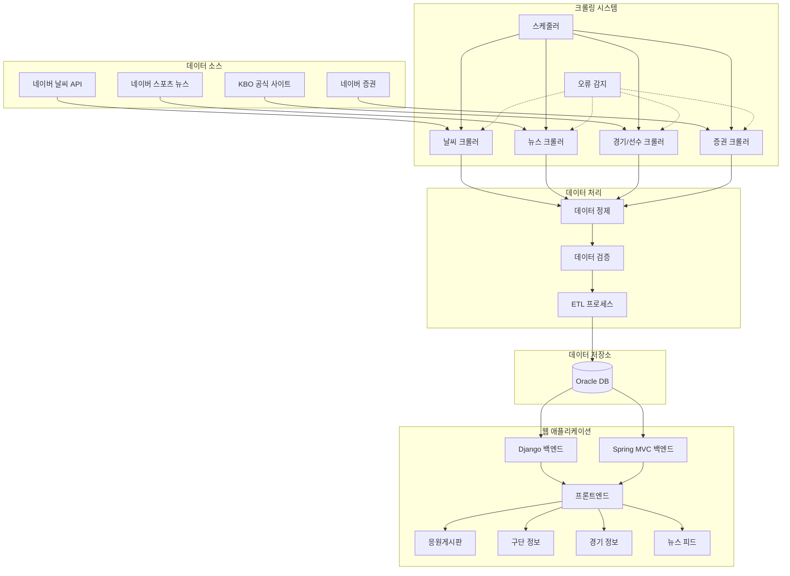

## 🏟️ KBO 리그 통합 데이터 플랫폼

### 📌 프로젝트 목표 및 개요

> 흩어진 KBO 리그 정보를 통합하여 팬들에게
> 
> 
> **경기 데이터, 뉴스, 구단 정보, 커뮤니티 기능**까지
> 
> 직관적으로 즐길 수 있는 **통합형 야구 정보 플랫폼**을 개발했습니다.
> 

---

### 🎯 주요 기능

- **실시간 KBO 경기 및 선수 데이터 통합 제공**
- 야구장 **위치 기반 날씨 정보 연동** 및 **시각화**
- **최신 KBO 뉴스 자동 수집** 및 뉴스 피드 제공
- 구단별 **모기업 증권 정보 시각화** (차트·지표 제공)
- **응원 게시판 커뮤니티 기능** 및 댓글/필터링/신고 시스템
- **데이터 출처, 오류 모니터링, 사용자 피드백 기반 신뢰성 확보**

---

### 🧩 기술 스택

- **Frontend**: HTML5 · CSS3 · JavaScript
- **Backend**: Django · Spring MVC · RESTful API
- **Data Crawling**: BeautifulSoup4 · Selenium
- **Database**: MySQL · Oracle
- **Infra / DevOps**: Git · GitHub

### ⚙️ 기술 선택 요약

> Python 기반 크롤러는 다양한 외부 소스로부터 데이터를 안정적으로 수집하고,
> 
> 
> RESTful API 기반 백엔드 통합으로 **Django와 Spring MVC의 기능을 유기적으로 연결**했습니다.
> 
> **Highcharts**와 커스텀 JS로 대용량 데이터 시각화 성능을 최적화했습니다.
> 

---

### 👨‍💻 주요 역할 및 기여

- **데이터 크롤러 개발 및 구조 변경 대응 로직 구현 (BeautifulSoup4, Selenium)**
- **Django / Spring MVC 이기종 백엔드 REST 통신 및 역할 분리 설계**
- **크롤링 스케줄러 및 오류 감지 로직 구현으로 데이터 품질 확보**
- **Highcharts 기반 대시보드 시각화 구성 및 인터랙션 최적화**
- **사용자 중심 응원 커뮤니티 기능 기획 및 UI/UX 설계**

---

### 🏆 주요 성과

- **웹사이트 구조 변경 대응을 위한 크롤링 안정성 확보**
- **Django & Spring MVC 기반 이기종 백엔드 통합 환경 구축**
- **대용량 KBO 데이터 시각화 성능 및 응답 속도 개선**

---

### 💡 기술적 도전 및 해결

- **크롤링 대상 사이트 구조 변경 대응**
    
    → XPath 우선순위 로직, CSS Selector 대체로 **자동 크롤링 방식 전환** 구현

- **이기종 백엔드 통합 설계**
    
    → RESTful API 표준화 + 공통 인증 시스템 구축
    
- **실시간 데이터 시각화 성능 저하 해결**
    
    → Highcharts 시리즈 최적화, 서버 측 데이터 전처리, **지연 로딩 적용**
    

---

### 🏗 시스템 아키텍처

---

### 🌱 성장 및 배움

- **크롤링 자동화 및 구조 변경 대응 로직 개발 경험**
- **이기종 시스템 통합 설계 및 REST API 기반 통신 구현 역량 강화**
- **데이터 기반 서비스 기획 및 사용자 시각화 경험 축적**
- **데이터 수집 → 정제 → 시각화까지 전체 파이프라인 실전 경험 확보**

---

### 🚀 향후 개선 방향

- **머신러닝 기반 경기 예측 기능 도입**
- **타자·투수 심화 지표 시각화 기능 확장**
- **공개 API 제공을 통한 외부 활용성 확대**
- **SNS 연동 커뮤니티 및 댓글 강화 기능 도입**

---
