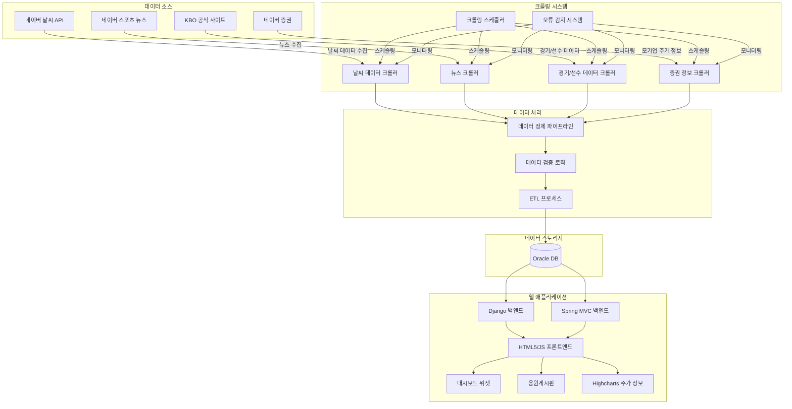

# 🏟️ KBO 리그 통합 데이터 플랫폼
## 📋 프로젝트 개요

KBO 리그의 경기 정보, 선수 통계, 야구장별 날씨 정보, 뉴스 등을 한 곳에서 제공하는 통합 데이터 플랫폼입니다. 분산된 야구 정보를 하나의 플랫폼에서 효율적으로 접근할 수 있도록 설계했습니다.

---

## 🔍 핵심 기능

### 1️⃣ 데이터 크롤링 시스템

- **야구장별 날씨 데이터**: 네이버 날씨 API 활용하여 5개 주요 야구장 위치별 날씨 정보 수집
- **야구 뉴스 크롤링**: 네이버 스포츠 뉴스에서 KBO 관련 뉴스 자동 수집
- **KBO 경기 데이터**: 공식 사이트에서 경기 결과, 선수 기록, 순위표 등 정보 자동 수집
- **구단 모기업 증권 정보**: 네이버 증권에서 각 구단 모기업의 주가 정보 수집 및 시각화

### 2️⃣ 데이터 통합 및 시각화

- 메인 대시보드에 경기 일정과 야구장별 날씨 정보를 위젯 형태로 통합 표시
- 날씨 데이터는 직관적인 아이콘과 수치로 표현하여 가독성 향상
- 구단별 페이지에 관련 뉴스, 선수 기록 정보를 탭 형태로 구성
- 구단 모기업의 주가 차트 및 재무정보 시각화

### 3️⃣ 응원게시판 커뮤니티

- 10개 구단별 개별 응원게시판 구축으로 팬들의 소통 공간 제공
- 게시글 작성 시 경기, 선수 태그 기능으로 관련 정보 자동 연결
- 댓글 알림 기능 구현
- 욕설 필터링 및 신고 기능으로 건전한 커뮤니티 환경 조성

### 4️⃣ 데이터 신뢰성 확보 방안

- 크롤링 오류 감지 시스템: 비정상적 데이터 패턴 감지 시 관리자 알림
- 사용자 제보 기능: 잘못된 정보나 누락된 데이터에 대한 피드백 시스템
- 데이터 출처 표기: 모든 크롤링 데이터의 원천과 최종 업데이트 시간 명시

---

## 🛠️ 핵심 기술 의사결정

| 의사결정 | 내용 | 장점 |
| --- | --- | --- |
| 위젯 형태의 날씨 데이터 표시 | 간결한 위젯 형태로 정보 인지 속도 향상 | • 정보 인지 속도 향상
• 레이아웃 통합이 용이
• 화면 공간 효율적 활용 |
| 데스크톱 웹 중심 설계 | 데이터 시각화와 정보 구조화에 넓은 화면 활용 | • 시각화에 충분한 공간 확보
• 개발 리소스 최적화 |
| 크롤링 기반 정보 수집 | 다양한 소스에서 데이터 자동 수집 | • 데이터 접근성 확보
• 여러 소스 통합
• 자동화와 확장성 확보 |

---

## 💡 기술적 도전과 해결 방법

### 🔄 크롤링 안정성 확보

- **문제**: 웹사이트의 HTML 구조 변경 시 크롤링이 실패할 가능성
- **해결**: Python 기반 페이지 구조 변경 감지 알고리즘을 개발하고, XPath와 CSS 선택자 우선순위 기반 대체 크롤링 경로 자동 전환 기능 구현
- **기술**: Python의 BeautifulSoup4, Selenium 활용, Django 관리자 시스템과 연동된 알림 시스템 구축
- **크롤링 코드 섹션**: 네이버 날씨/증권/뉴스 크롤링 스크립트 (별도 파일로 관리)

### 🔄 이기종 백엔드 통합 도전

- **문제**: Django와 Spring MVC를 함께 사용하는 복합 백엔드 환경에서 데이터 일관성 유지
- **해결**: RESTful API 표준화로 백엔드 간 통신 인터페이스 일원화, 공통 인증 시스템 구축으로 사용자 경험 통합
- **기술**: 마이크로서비스 아키텍처 적용하여 각 백엔드의 독립성 보장

### 📊 데이터 시각화 성능 최적화

- **문제**: 대용량 야구 통계 데이터의 실시간 시각화 시 브라우저 성능 저하
- **해결**: Highcharts 데이터 시리즈 최적화 및 데이터 포인트 샘플링 적용, 서버 사이드 데이터 전처리로 클라이언트 부하 감소
- **기술**: 사용자 인터랙션에 따른 지연 로딩 구현으로 초기 로딩 속도 개선

### 📈 구단 모기업 증권 정보 시각화

- **문제**: 구단과 모기업의 연관성 및 경영 상태를 팬들에게 직관적으로 제공
- **해결**: 네이버 증권 데이터 크롤링 및 Highcharts를 활용한 시각화 구현
- **기술**: 주가 추이 그래프, 주요 재무지표 대시보드 형태로 시각화

---

## 🔄 시스템 아키텍처

---

## 💻 기술 스택

### 프론트엔드

- 🌐 **HTML5, CSS3, JavaScript**: 웹 표준 기술
- 📊 **Highcharts**: 데이터 시각화 라이브러리

### 백엔드

- 🐍 **Django**: 주요 백엔드 프레임워크
- 🍃 **Spring MVC**: 보조 백엔드 프레임워크
- 🔄 **RESTful API**: 백엔드 통신 표준

### 데이터 처리

- 🐍 **Python (BeautifulSoup4, Selenium)**: 웹 크롤링
- 💾 **Oracle**: 관계형 데이터베이스

---

## 📝 배운 점과 향후 개선사항

### 배운 점

- 크롤링 기반 서비스의 법적, 윤리적 고려사항에 대한 이해 심화
- 데이터 수집-처리-시각화 파이프라인 구축 경험
- NoSQL 데이터베이스 설계 및 최적화 기술 습득
- 스포츠와 경제 데이터를 연계하는 통합 대시보드 설계 경험

### 향후 개선 계획

- 야구 통계 데이터 시각화 강화 (투수 구질별 성적, 타자 존별 타율 등)
- 경기 예측 알고리즘 개발
- 데이터 API 제공으로 개발자 생태계 구축
- 선수 SNS 데이터 통합하여 팬 소통 강화

---

## 🖼️ UI 디자인 시안

---

## **🎥 홈페이지 시연 영상**

---

## 📆 프로젝트 일정

> 프로젝트는 한 달 내에 모든 기능 개발을 완료하는 것을 목표로 진행되었으며, 주요 작업은 첫 2주 동안 집중적으로 이루어졌습니다.
> 

| 단계 | 날짜 | 상태 |
| --- | --- | --- |
| 기획서 작성 | 3일 | ✅ 완료 |
| 크롤링 개발 | 4-5일, 11-12일 | ✅ 완료 |
| 취합 및 가공 | 7-9일 | ✅ 완료 |
| 시각화 | 9-10일 | ✅ 완료 |
| 부가서비스 | 11-12일 | ✅ 완료 |
| PPT 제작 | 14-15일 | ✅ 완료 |

---

## 📜 Copyright  
© 2024 Bae-Sunny. All rights reserved.

